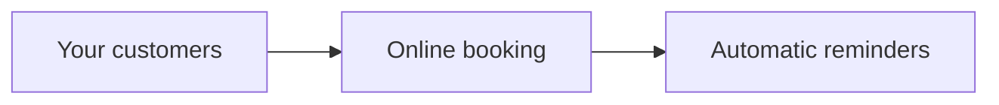

# Proposal Skill Implementation Plan

> **For agentic workers:** REQUIRED SUB-SKILL: Use superpowers:subagent-driven-development (recommended) or superpowers:executing-plans to implement this plan task-by-task. Steps use checkbox (`- [ ]`) syntax for tracking.

**Goal:** A `proposal` skill (third sibling in `plugins/solution-architect/`) that assembles a pre-sales client proposal from ARCHITECTURE.md + estimation.json into `proposal.md` (source of truth) and a self-contained, print-ready `proposal.html`.

**Architecture:** Markdown-as-source pipeline. The agent interviews, runs `derive.mjs` to see the client-facing figures (ranges + milestone splits deterministically derived from estimation.json), writes `proposal.md`, then `validate.mjs` (which recomputes the figures internally — the figures file is an authoring aid, never trusted) gates `render.mjs`, which fills `assets/proposal-template.html`. Spec: `docs/specs/2026-08-06-proposal-skill-design.md`.

**Tech Stack:** Node ≥ 20, zero npm dependencies, `node:test` runner. Reuses arch-docs libs (`embed.mjs`, `fonts.mjs`, `frontmatter.mjs`, `md-render.mjs`) and the estimate skill's fixtures via relative in-plugin paths.

## Global Constraints

- Node ≥ 20; scripts are dependency-free (no npm install, `node:` built-ins only).
- Quality gates (enforced by a test in this plan): ≤ 200 lines/file, ≤ 20 lines/function, ≤ 3 params/function, ≤ 10 functions/file.
- Conventional Commits; **never** add AI co-author/attribution lines to commits.
- Working directory for all commands: `plugins/solution-architect/skills/proposal/` unless a step says otherwise.
- Run every test as `node --test scripts/test/<file>` from that directory.
- Provenance/honesty house rules: no hand-invented numbers, no placeholders, unknowns rendered as honest absences.
- The 10 canonical section headings (exact strings, `##` level): `Executive Summary`, `Background & Objectives`, `Proposed Solution`, `Scope`, `Out of Scope & Assumptions`, `Delivery Approach`, `Investment & Timeline`, `Team`, `About <firm name>` (matched by the `About` prefix), `Next Steps`.
- Frontmatter keys (flat, parsed by arch-docs `frontmatter.mjs`): `client`, `client_tech_level` (`non-tech|low-tech|technical`), `scenario`, `currency`, `valid_until` (`YYYY-MM-DD`, future), `jargon_allow` (JSON array, optional), `source_architecture`, `source_estimation`.

---

### Task 1: Figures derivation (`lib/figures.mjs` + `derive.mjs` CLI)

estimation.json has no client-facing ranges: `computed.scenarios[id]` carries point values (`months`, `totalCost`, optional `roadmap` bands), and `computed.features[id]` carries `{hours, low, high}`. This task derives the proposal's numbers deterministically: scale the scenario's totals by the feature-spread ratios `Σlow/Σhours` and `Σhigh/Σhours`; split per-milestone by roadmap band share.

**Files:**
- Create: `plugins/solution-architect/skills/proposal/scripts/lib/figures.mjs`
- Create: `plugins/solution-architect/skills/proposal/scripts/derive.mjs`
- Test: `plugins/solution-architect/skills/proposal/scripts/test/figures.test.mjs`

**Interfaces:**
- Consumes: estimation.json shape produced by `../estimate/scripts/compute.mjs` (`{inputs, computed}` — see `estimate/scripts/lib/rollup.mjs`).
- Produces: `deriveFigures(estimation, scenarioId)` → `{scenario, cost: {low, high}, months: {low, high}, milestones: [{name, cost: {low, high}, months: {low, high}}], team: ["senior", "mid", ...]}` — throws `Error` with message `scenario "<id>" not in estimation.json` on an unknown id. Also `formatMoney(n)` → `"$8,000"` (en-US grouping), `round1(n)`, `round100(n)`. CLI: `node scripts/derive.mjs --estimation <path> --scenario <id> --out <path>` (exit 1 + message on unknown scenario).

- [ ] **Step 1: Write the failing test**

Create `scripts/test/figures.test.mjs`:

```js
import { test } from 'node:test';
import assert from 'node:assert/strict';
import { readFileSync, mkdtempSync } from 'node:fs';
import { execFileSync } from 'node:child_process';
import { tmpdir } from 'node:os';
import { join } from 'node:path';
import { writeFileSync } from 'node:fs';
import { deriveFigures, formatMoney } from '../lib/figures.mjs';

// Hand-checkable synthetic estimation: spread ratios are lo 0.8 / hi 1.2.
const estimation = {
  inputs: {
    scenarios: [{
      id: 's1', plan: 'max5x',
      team: [{ seniority: 'senior', rate: 50 }, { seniority: 'mid', rate: 40 }],
    }],
  },
  computed: {
    features: {
      a: { hours: 100, low: 80, high: 120 },
      b: { hours: 100, low: 80, high: 120 },
    },
    scenarios: {
      s1: {
        months: 2, totalCost: 10000,
        roadmap: [
          { name: 'M1', startMonths: 0, endMonths: 1.5 },
          { name: 'M2', startMonths: 1.5, endMonths: 2 },
        ],
      },
    },
  },
};

test('figures scale totals by the feature spread ratios', () => {
  const f = deriveFigures(estimation, 's1');
  assert.deepEqual(f.cost, { low: 8000, high: 12000 });
  assert.deepEqual(f.months, { low: 1.6, high: 2.4 });
});

test('milestone splits follow the roadmap band shares', () => {
  const f = deriveFigures(estimation, 's1');
  assert.deepEqual(f.milestones, [
    { name: 'M1', cost: { low: 6000, high: 9000 }, months: { low: 1.2, high: 1.8 } },
    { name: 'M2', cost: { low: 2000, high: 3000 }, months: { low: 0.4, high: 0.6 } },
  ]);
});

test('team lists seniorities only — rates never leave the estimate', () => {
  const f = deriveFigures(estimation, 's1');
  assert.deepEqual(f.team, ['senior', 'mid']);
  assert.doesNotMatch(JSON.stringify(f), /rate|50|40/);
});

test('no roadmap means no milestones, not a crash', () => {
  const noRoadmap = structuredClone(estimation);
  delete noRoadmap.computed.scenarios.s1.roadmap;
  assert.deepEqual(deriveFigures(noRoadmap, 's1').milestones, []);
});

test('unknown scenario throws with the id in the message', () => {
  assert.throws(() => deriveFigures(estimation, 'nope'), /scenario "nope" not in estimation\.json/);
});

test('formatMoney uses en-US grouping with a dollar sign', () => {
  assert.equal(formatMoney(8000), '$8,000');
  assert.equal(formatMoney(1234500), '$1,234,500');
});

test('derive.mjs CLI writes the figures file and refuses unknown scenarios', () => {
  const dir = mkdtempSync(join(tmpdir(), 'proposal-derive-'));
  const est = join(dir, 'estimation.json');
  writeFileSync(est, JSON.stringify(estimation));
  const out = join(dir, 'proposal-figures.json');
  const cli = new URL('../derive.mjs', import.meta.url).pathname;
  execFileSync('node', [cli, '--estimation', est, '--scenario', 's1', '--out', out]);
  assert.equal(JSON.parse(readFileSync(out, 'utf8')).cost.low, 8000);
  assert.throws(() => execFileSync('node', [cli, '--estimation', est, '--scenario', 'nope', '--out', out]));
});
```

- [ ] **Step 2: Run test to verify it fails**

Run: `node --test scripts/test/figures.test.mjs`
Expected: FAIL — `Cannot find module '.../lib/figures.mjs'`

- [ ] **Step 3: Write the implementation**

Create `scripts/lib/figures.mjs`:

```js
// Client-facing figures derived from estimation.json — the proposal never
// invents a number. Totals come from the chosen scenario; ranges scale by
// the feature low/high spread; milestone splits follow the roadmap shares.
export const round1 = (n) => Math.round(n * 10) / 10;
export const round100 = (n) => Math.round(n / 100) * 100;
export const formatMoney = (n) => `$${n.toLocaleString('en-US')}`;

function spreadRatios(computed) {
  const feats = Object.values(computed.features);
  const hours = feats.reduce((s, f) => s + f.hours, 0);
  return {
    lo: feats.reduce((s, f) => s + f.low, 0) / hours,
    hi: feats.reduce((s, f) => s + f.high, 0) / hours,
  };
}

const range = (value, ratios, round) => ({ low: round(value * ratios.lo), high: round(value * ratios.hi) });

function milestoneFigures(scenario, ratios) {
  return (scenario.roadmap ?? []).map((band) => {
    const width = band.endMonths - band.startMonths;
    return {
      name: band.name,
      cost: range(scenario.totalCost * (width / scenario.months), ratios, round100),
      months: range(width, ratios, round1),
    };
  });
}

export function deriveFigures(estimation, scenarioId) {
  const scenario = estimation.computed.scenarios[scenarioId];
  if (!scenario) throw new Error(`scenario "${scenarioId}" not in estimation.json`);
  const ratios = spreadRatios(estimation.computed);
  const team = (estimation.inputs.scenarios.find((s) => s.id === scenarioId)?.team ?? [])
    .map((m) => m.seniority);
  return {
    scenario: scenarioId,
    cost: range(scenario.totalCost, ratios, round100),
    months: range(scenario.months, ratios, round1),
    milestones: milestoneFigures(scenario, ratios),
    team,
  };
}
```

Create `scripts/derive.mjs`:

```js
import { readFileSync, writeFileSync } from 'node:fs';
import { deriveFigures } from './lib/figures.mjs';

function parseArgs(argv) {
  const args = {};
  for (let i = 0; i < argv.length; i += 1) {
    if (argv[i].startsWith('--')) args[argv[i].slice(2)] = argv[++i];
  }
  return args;
}

const args = parseArgs(process.argv.slice(2));
const estimation = JSON.parse(readFileSync(args.estimation, 'utf8'));
let figures;
try {
  figures = deriveFigures(estimation, args.scenario);
} catch (e) {
  console.error(e.message);
  process.exit(1);
}
writeFileSync(args.out, `${JSON.stringify(figures, null, 2)}\n`);
console.log(args.out);
```

- [ ] **Step 4: Run test to verify it passes**

Run: `node --test scripts/test/figures.test.mjs`
Expected: PASS (7 tests)

- [ ] **Step 5: Commit**

```bash
git add plugins/solution-architect/skills/proposal/scripts
git commit -m "feat(proposal): derive client figures from estimation.json"
```

---

### Task 2: Document checks (`lib/sections.mjs`, `lib/checks-doc.mjs`)

Structural half of the validator: frontmatter contract, the 10 sections, placeholder scan, future validity date, mermaid diagram presence.

**Files:**
- Create: `plugins/solution-architect/skills/proposal/scripts/lib/sections.mjs`
- Create: `plugins/solution-architect/skills/proposal/scripts/lib/checks-doc.mjs`
- Test: `plugins/solution-architect/skills/proposal/scripts/test/checks-doc.test.mjs`

**Interfaces:**
- Consumes: `parseFrontmatter(md)` from `../../../arch-docs/scripts/lib/frontmatter.mjs` (returns `{data}` or `{data: null, error}`; flat keys; JSON arrays parsed).
- Produces: `sectionText(md, name)` → section body string or `null` (from a `## <name>` heading to the next `##`); `tables(text)` → `[{header: [..], rows: [[..]]}]`; `SECTIONS` (array of the 10 heading names, `'About'` as prefix); `checkDoc({fm, md, estimation, today})` → findings `string[]`. Later tasks import all of these.

- [ ] **Step 1: Write the failing test**

Create `scripts/test/checks-doc.test.mjs`:

```js
import { test } from 'node:test';
import assert from 'node:assert/strict';
import { sectionText, tables } from '../lib/sections.mjs';
import { checkDoc } from '../lib/checks-doc.mjs';
import { parseFrontmatter } from '../../../arch-docs/scripts/lib/frontmatter.mjs';

const estimation = { computed: { scenarios: { s1: { months: 2, totalCost: 10000 } } }, inputs: { scenarios: [{ id: 's1', team: [] }] } };
const TODAY = new Date('2026-08-06');

const FM = `---
client: Acme Corp
client_tech_level: non-tech
scenario: s1
currency: USD
valid_until: 2099-12-31
source_architecture: ../ARCHITECTURE.md
source_estimation: ../estimation.json
---`;

const SECTION_BODIES = `
## Executive Summary
We fix scheduling.
## Background & Objectives
Bookings are manual today.
## Proposed Solution
\`\`\`mermaid
graph LR; A[You] --> B[New system]
\`\`\`
## Scope
| Feature | What you get |
| --- | --- |
| Booking | Online appointments |
## Out of Scope & Assumptions
- SMS reminders are out.
## Delivery Approach
Two milestones, weekly demos.
## Investment & Timeline
$8,000 – $12,000 over 1.6–2.4 months.
## Team
One senior engineer, one mid-level engineer.
## About Code Engine Studio
We build software. Contact: hello@example.com
## Next Steps
Valid until 2099-12-31. Reply to accept.
`;

const goodMd = `${FM}\n${SECTION_BODIES}`;
const check = (md) => checkDoc({ fm: parseFrontmatter(md).data, md, estimation, today: TODAY });

test('a complete document produces no findings', () => {
  assert.deepEqual(check(goodMd), []);
});

test('sectionText slices one section and returns null for missing ones', () => {
  assert.match(sectionText(goodMd, 'Scope'), /Online appointments/);
  assert.doesNotMatch(sectionText(goodMd, 'Scope'), /SMS reminders/);
  assert.equal(sectionText(goodMd, 'Signature'), null);
});

test('tables groups pipe rows and drops the separator', () => {
  const [t] = tables(sectionText(goodMd, 'Scope'));
  assert.deepEqual(t.header, ['Feature', 'What you get']);
  assert.deepEqual(t.rows, [['Booking', 'Online appointments']]);
});

test('every missing or empty section is a finding', () => {
  const noTeam = goodMd.replace(/## Team[\s\S]*?(?=## About)/, '');
  assert.ok(check(noTeam).some((f) => f.includes('Team')));
  const emptyScope = goodMd.replace('| Booking | Online appointments |\n', '')
    .replace('## Scope\n| Feature | What you get |\n| --- | --- |', '## Scope');
  assert.ok(check(emptyScope).some((f) => f.includes('Scope')));
});

test('frontmatter contract: missing key, bad tech level, unknown scenario', () => {
  assert.ok(check(goodMd.replace('currency: USD\n', '')).some((f) => f.includes('currency')));
  assert.ok(check(goodMd.replace('non-tech', 'wizard')).some((f) => f.includes('client_tech_level')));
  assert.ok(check(goodMd.replace('scenario: s1', 'scenario: ghost')).some((f) => f.includes('ghost')));
});

test('valid_until must be a future ISO date', () => {
  assert.ok(check(goodMd.replace('2099-12-31', '2020-01-01')).some((f) => f.includes('valid_until')));
  assert.ok(check(goodMd.replace('2099-12-31', 'someday')).some((f) => f.includes('valid_until')));
});

test('placeholders and empty tables are findings', () => {
  assert.ok(check(goodMd.replace('We fix scheduling.', 'TBD')).some((f) => /placeholder/i.test(f)));
  assert.ok(check(`${goodMd}\n| A | B |\n| --- | --- |\n`).some((f) => /empty table/i.test(f)));
});

test('Proposed Solution must carry a mermaid diagram', () => {
  const noDiagram = goodMd.replace(/```mermaid[\s\S]*?```/, 'A drawing.');
  assert.ok(check(noDiagram).some((f) => f.includes('mermaid')));
});
```

- [ ] **Step 2: Run test to verify it fails**

Run: `node --test scripts/test/checks-doc.test.mjs`
Expected: FAIL — `Cannot find module '.../lib/sections.mjs'`

- [ ] **Step 3: Write the implementation**

Create `scripts/lib/sections.mjs`:

```js
// Section slicing + table parsing for proposal.md — same approach as the
// estimate skill's checks.mjs, section names fixed by the writing contract.
export const SECTIONS = [
  'Executive Summary', 'Background & Objectives', 'Proposed Solution', 'Scope',
  'Out of Scope & Assumptions', 'Delivery Approach', 'Investment & Timeline',
  'Team', 'About', 'Next Steps',
];

export const escapeRegExp = (s) => s.replace(/[.*+?^${}()|[\]\\]/g, '\\$&');

export function sectionText(md, name) {
  const m = new RegExp(`^##\\s+${escapeRegExp(name)}.*$`, 'm').exec(md);
  if (!m) return null;
  const rest = md.slice(m.index + m[0].length);
  const next = rest.search(/^##\s/m);
  return rest.slice(0, next === -1 ? undefined : next);
}

const cells = (line) => line.trim().replace(/^\|/, '').replace(/\|$/, '').split('|').map((c) => c.trim());

export function tables(text) {
  const groups = [];
  let cur = [];
  for (const line of (text ?? '').split('\n')) {
    if (/^\s*\|/.test(line)) cur.push(line);
    else if (cur.length) { groups.push(cur); cur = []; }
  }
  if (cur.length) groups.push(cur);
  return groups
    .map((g) => g.filter((l) => !/^\s*\|?[\s:|-]+\|?\s*$/.test(l)))
    .map((g) => ({ header: cells(g[0]), rows: g.slice(1).map(cells) }));
}
```

Create `scripts/lib/checks-doc.mjs`:

```js
// Structural half of the proposal gate: frontmatter contract, the ten
// sections, placeholder scan, future validity. Client-safety checks live
// in checks-client.mjs.
import { SECTIONS, sectionText, tables } from './sections.mjs';

const FM_KEYS = ['client', 'client_tech_level', 'scenario', 'currency',
  'valid_until', 'source_architecture', 'source_estimation'];
const TECH_LEVELS = ['non-tech', 'low-tech', 'technical'];

function checkFrontmatter({ fm, estimation, today }, out) {
  for (const key of FM_KEYS) {
    if (!fm[key]) out.push(`frontmatter: missing "${key}"`);
  }
  if (fm.client_tech_level && !TECH_LEVELS.includes(fm.client_tech_level)) {
    out.push(`frontmatter: client_tech_level must be ${TECH_LEVELS.join('|')}`);
  }
  if (fm.scenario && !estimation.computed.scenarios[fm.scenario]) {
    out.push(`frontmatter: scenario "${fm.scenario}" not in estimation.json`);
  }
  checkValidUntil(fm.valid_until, today, out);
}

function checkValidUntil(raw, today, out) {
  if (!raw) return;
  const wellFormed = /^\d{4}-\d{2}-\d{2}$/.test(raw) && !Number.isNaN(Date.parse(raw));
  if (!wellFormed) { out.push('frontmatter: valid_until must be an ISO date (YYYY-MM-DD)'); return; }
  if (new Date(raw) <= today) out.push(`frontmatter: valid_until ${raw} is not in the future`);
}

function checkSections(md, out) {
  for (const name of SECTIONS) {
    const body = sectionText(md, name);
    if (body === null) { out.push(`missing ## ${name} section`); continue; }
    if (!body.trim()) out.push(`## ${name} section is empty`);
  }
  const solution = sectionText(md, 'Proposed Solution');
  if (solution !== null && !solution.includes('```mermaid')) {
    out.push('Proposed Solution has no mermaid diagram');
  }
}

function checkPlaceholders(md, out) {
  if (/\[TODO\]|\bTBD\b|\bTODO\b|lorem ipsum/i.test(md)) out.push('placeholder text found (TODO/TBD/lorem ipsum)');
  for (const t of tables(md)) {
    if (t.rows.length === 0) out.push(`empty table under header "${t.header.join(' | ')}"`);
  }
}

export function checkDoc({ fm, md, estimation, today }, out = []) {
  checkFrontmatter({ fm, estimation, today }, out);
  checkSections(md, out);
  checkPlaceholders(md, out);
  return out;
}
```

- [ ] **Step 4: Run test to verify it passes**

Run: `node --test scripts/test/checks-doc.test.mjs`
Expected: PASS (8 tests)

- [ ] **Step 5: Commit**

```bash
git add plugins/solution-architect/skills/proposal/scripts
git commit -m "feat(proposal): structural document checks"
```

---

### Task 3: Client-safety checks, aggregator, `validate.mjs` CLI, fixtures

Second half of the gate: every money/duration number matches the recomputed figures, no internal leakage, jargon scan for non-tech clients. Plus the CLI and the committed fixture pair.

**Files:**
- Create: `plugins/solution-architect/skills/proposal/scripts/lib/jargon.mjs`
- Create: `plugins/solution-architect/skills/proposal/scripts/lib/checks-client.mjs`
- Create: `plugins/solution-architect/skills/proposal/scripts/lib/checks.mjs`
- Create: `plugins/solution-architect/skills/proposal/scripts/validate.mjs`
- Create: `plugins/solution-architect/skills/proposal/scripts/test/fixtures/proposal-pass.md`
- Create: `plugins/solution-architect/skills/proposal/scripts/test/fixtures/proposal-fail.md`
- Test: `plugins/solution-architect/skills/proposal/scripts/test/checks-client.test.mjs`
- Test: `plugins/solution-architect/skills/proposal/scripts/test/validate.test.mjs`

**Interfaces:**
- Consumes: `deriveFigures`, `formatMoney` (Task 1); `checkDoc`, `sectionText`, `escapeRegExp` (Task 2); `parseFrontmatter` (arch-docs).
- Produces: `JARGON` (lowercase term array); `checkClient({fm, md, estimation}, out)`; `checkProposal({md, estimation, today = new Date()})` → findings `string[]` (the single entry point — render reuses it). CLI: `node scripts/validate.mjs --md <path> --estimation <path>` → exit 0 + `proposal deliverable valid`, or exit 1 + findings on stderr.

- [ ] **Step 1: Write the failing unit test**

Create `scripts/test/checks-client.test.mjs`:

```js
import { test } from 'node:test';
import assert from 'node:assert/strict';
import { checkProposal } from '../lib/checks.mjs';
import { JARGON } from '../lib/jargon.mjs';

// Same synthetic estimation as figures.test.mjs: figures are
// cost 8000/12000, months 1.6/2.4, M1 6000/9000 1.2/1.8, M2 2000/3000 0.4/0.6.
const estimation = {
  inputs: {
    scenarios: [
      { id: 's1', plan: 'max5x', team: [{ seniority: 'senior', rate: 50 }] },
      { id: 's2-secret', plan: 'none', team: [{ seniority: 'mid', rate: 40 }] },
    ],
  },
  computed: {
    features: { a: { hours: 100, low: 80, high: 120 }, b: { hours: 100, low: 80, high: 120 } },
    scenarios: {
      s1: {
        months: 2, totalCost: 10000,
        roadmap: [
          { name: 'M1', startMonths: 0, endMonths: 1.5 },
          { name: 'M2', startMonths: 1.5, endMonths: 2 },
        ],
      },
      's2-secret': { months: 3, totalCost: 15000 },
    },
  },
};
const TODAY = new Date('2026-08-06');

const md = `---
client: Acme Corp
client_tech_level: non-tech
scenario: s1
currency: USD
valid_until: 2099-12-31
source_architecture: ../ARCHITECTURE.md
source_estimation: ../estimation.json
---

## Executive Summary
New booking system for $8,000 – $12,000, delivered in 1.6–2.4 months.
## Background & Objectives
Bookings are manual today.
## Proposed Solution
\`\`\`mermaid
graph LR; A[Your customers] --> B[New system]
\`\`\`
## Scope
| Feature | What you get |
| --- | --- |
| Booking | Online appointments |
## Out of Scope & Assumptions
- Text-message reminders are out.
## Delivery Approach
M1 runs 1.2–1.8 months; M2 runs 0.4–0.6 months. Weekly demos.
## Investment & Timeline
| Milestone | Duration | Investment |
| --- | --- | --- |
| M1 | 1.2–1.8 months | $6,000 – $9,000 |
| M2 | 0.4–0.6 months | $2,000 – $3,000 |

Total: $8,000 – $12,000 over 1.6–2.4 months.
## Team
One senior engineer.
## About Code Engine Studio
We build software. Contact: hello@example.com
## Next Steps
Valid until 2099-12-31. Reply to accept.
`;

const run = (doc) => checkProposal({ md: doc, estimation, today: TODAY });

test('a document whose numbers all trace to the figures passes', () => {
  assert.deepEqual(run(md), []);
});

test('an invented money amount is a finding', () => {
  assert.ok(run(md.replace('$6,000', '$6,500')).some((f) => f.includes('6,500') || f.includes('6500')));
});

test('an invented duration bound is a finding', () => {
  assert.ok(run(md.replace('1.6–2.4 months.\n## Team', '1.6–9.9 months.\n## Team'))
    .some((f) => f.includes('9.9')));
});

test('the headline cost range must be present', () => {
  const noTotals = md.replaceAll('$8,000 – $12,000', 'a fair price').replaceAll('1.6–2.4 months', 'a short time');
  const findings = run(noTotals);
  assert.ok(findings.some((f) => f.includes('8,000')));
  assert.ok(findings.some((f) => f.includes('2.4')));
});

test('other scenario ids and provenance markup are leaks', () => {
  assert.ok(run(md.replace('Weekly demos.', 'Cheaper than s2-secret.')).some((f) => f.includes('s2-secret')));
  assert.ok(run(md.replace('| Feature | What you get |', '| Feature | src |')).some((f) => f.includes('src')));
  assert.ok(run(md.replace('Weekly demos.', '| observed |')).some((f) => f.includes('observed')));
});

test('non-tech jargon fails, jargon_allow overrides per term', () => {
  const jargony = md.replace('Weekly demos.', 'We deploy the API to Kubernetes.');
  const findings = run(jargony);
  assert.ok(findings.some((f) => /kubernetes/i.test(f)));
  assert.ok(findings.some((f) => /\bapi\b/i.test(f)));
  const allowed = jargony.replace('valid_until: 2099-12-31', 'valid_until: 2099-12-31\njargon_allow: ["api", "kubernetes"]');
  assert.deepEqual(run(allowed), []);
});

test('technical clients skip the jargon scan; the About section is exempt', () => {
  const techDoc = md.replace('client_tech_level: non-tech', 'client_tech_level: technical')
    .replace('Weekly demos.', 'We deploy the API to Kubernetes.');
  assert.deepEqual(run(techDoc), []);
  const aboutJargon = md.replace('We build software.', 'We build software and Kubernetes platforms.');
  assert.deepEqual(run(aboutJargon), []);
});

test('the deny-list is lowercase and non-trivial', () => {
  assert.ok(JARGON.length >= 12);
  for (const term of JARGON) assert.equal(term, term.toLowerCase());
});
```

- [ ] **Step 2: Run test to verify it fails**

Run: `node --test scripts/test/checks-client.test.mjs`
Expected: FAIL — `Cannot find module '.../lib/checks.mjs'`

- [ ] **Step 3: Write the implementation**

Create `scripts/lib/jargon.mjs`:

```js
// Deny-list for the non-tech jargon scan. Deliberately small: it catches the
// habitual offenders; the fresh-eyes review catches the rest. Terms are
// matched whole-word, case-insensitive; frontmatter jargon_allow overrides
// per term when the client themselves uses it.
export const JARGON = [
  'api', 'backend', 'frontend', 'middleware', 'kubernetes', 'docker',
  'microservice', 'microservices', 'ci/cd', 'oauth', 'sql', 'nosql',
  'webhook', 'endpoint', 'orm', 'latency', 'schema', 'refactor', 'devops',
];
```

Create `scripts/lib/checks-client.mjs`:

```js
// Client-safety half of the proposal gate: every number traces to the
// derived figures, nothing internal leaks, and non-tech documents carry no
// jargon outside the About section.
import { deriveFigures } from './figures.mjs';
import { sectionText, escapeRegExp } from './sections.mjs';
import { JARGON } from './jargon.mjs';

const flat = (f) => [
  f.cost.low, f.cost.high, f.months.low, f.months.high,
  ...f.milestones.flatMap((m) => [m.cost.low, m.cost.high, m.months.low, m.months.high]),
];

function checkMoney(md, figures, out) {
  const allowed = new Set(flat(figures));
  for (const m of md.matchAll(/[$€£]\s?([\d,]+(?:\.\d+)?)/g)) {
    const n = Number(m[1].replaceAll(',', ''));
    if (!allowed.has(n)) out.push(`money amount ${m[0].trim()} not derived from estimation.json`);
  }
  for (const m of md.matchAll(/(\d+(?:\.\d+)?)\s*[–-]\s*(\d+(?:\.\d+)?)\s+months/g)) {
    for (const bound of [Number(m[1]), Number(m[2])]) {
      if (!allowed.has(bound)) out.push(`duration bound ${bound} months not derived from estimation.json`);
    }
  }
}

function checkHeadline(md, figures, out) {
  for (const n of [figures.cost.low, figures.cost.high]) {
    if (!md.includes(n.toLocaleString('en-US'))) out.push(`headline cost bound ${n.toLocaleString('en-US')} missing`);
  }
  for (const n of [figures.months.low, figures.months.high]) {
    if (!new RegExp(`\\b${escapeRegExp(String(n))}\\b`).test(md)) out.push(`headline duration bound ${n} missing`);
  }
}

function checkLeaks({ md, fm, estimation }, out) {
  for (const s of estimation.inputs.scenarios ?? []) {
    if (s.id !== fm.scenario && md.includes(s.id)) out.push(`leak: scenario id "${s.id}"`);
  }
  if (/\|\s*src\s*\|/i.test(md)) out.push('leak: provenance "src" column');
  if (/data-internal/.test(md)) out.push('leak: data-internal marker');
  for (const word of ['observed', 'researched']) {
    if (new RegExp(`\\|\\s*${word}\\s*\\|`).test(md)) out.push(`leak: provenance cell "${word}"`);
  }
}

function checkJargon({ md, fm }, out) {
  if (fm.client_tech_level !== 'non-tech') return;
  const allow = new Set((Array.isArray(fm.jargon_allow) ? fm.jargon_allow : []).map((w) => w.toLowerCase()));
  const about = sectionText(md, 'About');
  const scanned = md.replace(/^---\n[\s\S]*?\n---/, '').replace(about ?? '', '');
  for (const term of JARGON) {
    if (allow.has(term)) continue;
    if (new RegExp(`(?<![\\w/])${escapeRegExp(term)}(?![\\w/])`, 'i').test(scanned)) {
      out.push(`jargon for a non-tech client: "${term}" (rewrite plainly or add to jargon_allow)`);
    }
  }
}

export function checkClient({ md, fm, estimation }, out = []) {
  const figures = deriveFigures(estimation, fm.scenario);
  checkMoney(md, figures, out);
  checkHeadline(md, figures, out);
  checkLeaks({ md, fm, estimation }, out);
  checkJargon({ md, fm }, out);
  return out;
}
```

Create `scripts/lib/checks.mjs`:

```js
// The proposal gate. validate.mjs prints these findings; render.mjs runs
// the same function and refuses to write proposal.html on any finding.
// Figures are recomputed from estimation.json here — proposal-figures.json
// is an authoring aid, never an input, so hand-edited figures cannot pass.
import { parseFrontmatter } from '../../../arch-docs/scripts/lib/frontmatter.mjs';
import { checkDoc } from './checks-doc.mjs';
import { checkClient } from './checks-client.mjs';

export function checkProposal({ md, estimation, today = new Date() }) {
  const { data: fm, error } = parseFrontmatter(md);
  if (!fm) return [`frontmatter: ${error}`];
  const out = checkDoc({ fm, md, estimation, today });
  if (fm.scenario && estimation.computed.scenarios[fm.scenario]) {
    checkClient({ md, fm, estimation }, out);
  }
  return out;
}
```

Create `scripts/validate.mjs`:

```js
import { readFileSync } from 'node:fs';
import { checkProposal } from './lib/checks.mjs';

function parseArgs(argv) {
  const args = {};
  for (let i = 0; i < argv.length; i += 1) {
    if (argv[i].startsWith('--')) args[argv[i].slice(2)] = argv[++i];
  }
  return args;
}

const args = parseArgs(process.argv.slice(2));
const md = readFileSync(args.md, 'utf8');
const estimation = JSON.parse(readFileSync(args.estimation, 'utf8'));
const findings = checkProposal({ md, estimation });
if (findings.length) {
  console.error(findings.join('\n'));
  process.exit(1);
}
console.log('proposal deliverable valid');
```

- [ ] **Step 4: Run unit test to verify it passes**

Run: `node --test scripts/test/checks-client.test.mjs`
Expected: PASS (9 tests)

- [ ] **Step 5: Build the committed fixtures against the real estimate pipeline**

Generate a real estimation.json from the estimate skill's canonical fixture, then read the derived figures:

```bash
node ../estimate/scripts/compute.mjs \
  --inputs ../estimate/scripts/test/fixtures/booking-inputs.json \
  --out /tmp/claude-1000/booking-estimation.json
node scripts/derive.mjs --estimation /tmp/claude-1000/booking-estimation.json \
  --scenario 2eng-max5x --out /tmp/claude-1000/figures.json
cat /tmp/claude-1000/figures.json
```

Create `scripts/test/fixtures/proposal-pass.md` with the skeleton below, replacing every `«...»` token with the exact value from `/tmp/claude-1000/figures.json` (`«CL»`/`«CH»` = `cost.low`/`cost.high` formatted `$X,XXX` en-US; `«ML»`/`«MH»` = `months.low`/`months.high`; `«M1CL»` etc. = milestone entries the same way). No `«` may remain in the committed file.

````markdown
---
client: Acme Corp
client_tech_level: non-tech
scenario: 2eng-max5x
currency: USD
valid_until: 2099-12-31
source_architecture: ../ARCHITECTURE.md
source_estimation: ../estimation.json
---

# Acme Corp — Proposal

## Executive Summary
Your customers book by phone today; every double-booking costs you a client. We will build an online booking system for «CL» – «CH», delivered in «ML»–«MH» months by a two-person team.

## Background & Objectives
Acme staff manage appointments by hand. The goal: customers book online, reminders go out automatically, and no slot is ever double-booked, live within «MH» months.

## Proposed Solution
One new system with two parts: the booking page your customers see, and reminders that go out on their own.



## Scope
| Feature | What you get |
| --- | --- |
| Online booking | Customers pick a free slot; double-booking is impossible |
| Automatic reminders | Customers get an email before their appointment |

## Out of Scope & Assumptions
- Text-message reminders are not included.
- Recurring bookings are not included.
- We assume all bookings happen in a single timezone.

## Delivery Approach
Two milestones. M1 - Booking core runs «M1ML»–«M1MH» months; M2 - Notifications runs «M2ML»–«M2MH» months. You see a working demo every week, and each milestone ends with your sign-off.

## Investment & Timeline
| Milestone | Duration | Investment |
| --- | --- | --- |
| M1 - Booking core | «M1ML»–«M1MH» months | «M1CL» – «M1CH» |
| M2 - Notifications | «M2ML»–«M2MH» months | «M2CL» – «M2CH» |

**Total: «CL» – «CH» over «ML»–«MH» months.** The range reflects estimation confidence; we confirm a fixed price before each milestone begins.

## Team
One senior engineer and one mid-level engineer, working with AI-assisted tooling.

## About Code Engine Studio
We build custom software for small businesses. Recent work: a clinic scheduling system and a salon booking app. Contact: hello@codeenginestudio.com

## Next Steps
This proposal is valid until 2099-12-31. To proceed, reply with your acceptance and we schedule the kick-off call within one week.
````

Create `scripts/test/fixtures/proposal-fail.md` — same frontmatter but `valid_until: 2020-01-01`, only three sections, and every violation class:

```markdown
---
client: Acme Corp
client_tech_level: non-tech
scenario: 2eng-max5x
currency: USD
valid_until: 2020-01-01
source_architecture: ../ARCHITECTURE.md
source_estimation: ../estimation.json
---

# Acme Corp — Proposal

## Executive Summary
TBD — we deploy the backend API for $9,999.

## Scope
| Feature | src |
| --- | --- |
| Booking | observed |

## Investment & Timeline
Total: $9,999 over 1–99 months. Cheaper than 3eng-noai.
```

- [ ] **Step 6: Write the failing CLI test**

Create `scripts/test/validate.test.mjs`:

```js
import { test } from 'node:test';
import assert from 'node:assert/strict';
import { mkdtempSync } from 'node:fs';
import { execFileSync } from 'node:child_process';
import { tmpdir } from 'node:os';
import { join } from 'node:path';

const cli = new URL('../validate.mjs', import.meta.url).pathname;
const computeCli = new URL('../../../estimate/scripts/compute.mjs', import.meta.url).pathname;
const inputs = new URL('../../../estimate/scripts/test/fixtures/booking-inputs.json', import.meta.url).pathname;
const passMd = new URL('./fixtures/proposal-pass.md', import.meta.url).pathname;
const failMd = new URL('./fixtures/proposal-fail.md', import.meta.url).pathname;

function estimationPath() {
  const dir = mkdtempSync(join(tmpdir(), 'proposal-validate-'));
  const json = join(dir, 'estimation.json');
  execFileSync('node', [computeCli, '--inputs', inputs, '--out', json]);
  return json;
}

test('the pass fixture validates clean', () => {
  const out = execFileSync('node', [cli, '--md', passMd, '--estimation', estimationPath()], { encoding: 'utf8' });
  assert.match(out, /proposal deliverable valid/);
});

test('the fail fixture exits 1 and names every violation class', () => {
  let err;
  try {
    execFileSync('node', [cli, '--md', failMd, '--estimation', estimationPath()], { encoding: 'utf8' });
  } catch (e) { err = e; }
  assert.ok(err, 'expected non-zero exit');
  const findings = err.stderr.toString();
  assert.match(findings, /missing ## Team/);
  assert.match(findings, /placeholder/i);
  assert.match(findings, /valid_until/);
  assert.match(findings, /9,999|9999/);
  assert.match(findings, /"src"/);
  assert.match(findings, /3eng-noai/);
  assert.match(findings, /jargon/i);
});
```

- [ ] **Step 7: Run the CLI test**

Run: `node --test scripts/test/validate.test.mjs`
Expected: PASS. If the pass-fixture test fails on a number finding, a `«...»` token was substituted wrong — re-run Step 5's `cat` and fix the fixture, do not touch the checks.

- [ ] **Step 8: Commit**

```bash
git add plugins/solution-architect/skills/proposal/scripts
git commit -m "feat(proposal): client-safety checks and validate CLI"
```

---

### Task 4: Template + `render.mjs`

Self-contained, print-ready client page. Reuses arch-docs `md-render.mjs` (markdown → HTML, mermaid fences become `<div class="mermaid-canvas">`), `embed.mjs` (slot filling), `fonts.mjs` (IBM Plex data URIs).

**Files:**
- Create: `plugins/solution-architect/skills/proposal/assets/proposal-template.html`
- Create: `plugins/solution-architect/skills/proposal/scripts/render.mjs`
- Test: `plugins/solution-architect/skills/proposal/scripts/test/render.test.mjs`

**Interfaces:**
- Consumes: `checkProposal` (Task 3); arch-docs `embed({template, slots})` (throws on missing/unused slots), `buildFontFaces(fontsDir)`, `renderMarkdown(md)` → `{html, headings: [{level, text, slug}], title}`, `escapeHtml`, `parseFrontmatter`.
- Produces: CLI `node scripts/render.mjs --md <path> --estimation <path> --mermaid-bundle <path> --out <dir>` → writes `<dir>/proposal.html`; exit 1 on validation findings, a missing `--mermaid-bundle`, or a bundle containing a literal `</script`. Template slots: exactly `TITLE`, `FONTS`, `NAV`, `CONTENT`, `MERMAID_BUNDLE`.

- [ ] **Step 1: Write the failing test**

Create `scripts/test/render.test.mjs`:

```js
import { test } from 'node:test';
import assert from 'node:assert/strict';
import { readFileSync, writeFileSync, mkdtempSync } from 'node:fs';
import { execFileSync } from 'node:child_process';
import { tmpdir } from 'node:os';
import { join } from 'node:path';

const tpl = () => readFileSync(new URL('../../assets/proposal-template.html', import.meta.url), 'utf8');
const cli = new URL('../render.mjs', import.meta.url).pathname;
const computeCli = new URL('../../../estimate/scripts/compute.mjs', import.meta.url).pathname;
const inputs = new URL('../../../estimate/scripts/test/fixtures/booking-inputs.json', import.meta.url).pathname;
const passMd = new URL('./fixtures/proposal-pass.md', import.meta.url).pathname;
const failMd = new URL('./fixtures/proposal-fail.md', import.meta.url).pathname;

// A stub is enough: the test asserts inlining, not diagram rendering.
const STUB_BUNDLE = 'globalThis.mermaid={initialize(){},run(){}};';

function rendered(md = passMd) {
  const dir = mkdtempSync(join(tmpdir(), 'proposal-render-'));
  const json = join(dir, 'estimation.json');
  execFileSync('node', [computeCli, '--inputs', inputs, '--out', json]);
  const bundle = join(dir, 'mermaid.js');
  writeFileSync(bundle, STUB_BUNDLE);
  execFileSync('node', [cli, '--md', md, '--estimation', json, '--mermaid-bundle', bundle, '--out', dir]);
  return readFileSync(join(dir, 'proposal.html'), 'utf8');
}

test('template carries exactly the five slots and no external URLs', () => {
  const markers = [...tpl().matchAll(/<!-- slot:(\w+) -->/g)].map((m) => m[1]).sort();
  assert.deepEqual([...new Set(markers)], ['CONTENT', 'FONTS', 'MERMAID_BUNDLE', 'NAV', 'TITLE']);
  assert.doesNotMatch(tpl(), /https?:\/\/(?!www\.w3\.org)/);
});

test('template is print-ready', () => {
  assert.match(tpl(), /@media print/);
  assert.match(tpl(), /break-inside/);
  assert.match(tpl(), /@page/);
});

test('render refuses a proposal that fails validation', () => {
  assert.throws(() => rendered(failMd));
});

test('rendered page is self-contained with fonts, nav, and all ten sections', () => {
  const html = rendered();
  assert.doesNotMatch(html, /<!-- slot:/);
  assert.match(html, /@font-face/);
  assert.match(html, /globalThis\.mermaid/);
  assert.doesNotMatch(html, /<(link|script|img)[^>]+(href|src)="https?:/);
  for (const name of ['Executive Summary', 'Investment &amp; Timeline', 'Next Steps']) {
    assert.match(html, new RegExp(`<h2[^>]*>${name}</h2>`));
  }
  assert.match(html, /<nav[\s\S]*?Executive Summary[\s\S]*?<\/nav>/);
  assert.match(html, /Proposal — Acme Corp/);
});

test('rendered page carries the mermaid canvas and no internal markers', () => {
  const html = rendered();
  assert.match(html, /class="mermaid-canvas"/);
  assert.doesNotMatch(html, /data-internal|viewer-link/);
});

test('render refuses a bundle carrying a literal script terminator', () => {
  const dir = mkdtempSync(join(tmpdir(), 'proposal-render-'));
  const json = join(dir, 'estimation.json');
  execFileSync('node', [computeCli, '--inputs', inputs, '--out', json]);
  const bundle = join(dir, 'mermaid.js');
  writeFileSync(bundle, 'var x = "</script>";');
  assert.throws(() => execFileSync('node', [cli, '--md', passMd, '--estimation', json, '--mermaid-bundle', bundle, '--out', dir]));
});
```

- [ ] **Step 2: Run test to verify it fails**

Run: `node --test scripts/test/render.test.mjs`
Expected: FAIL — template file does not exist.

- [ ] **Step 3: Write the template**

Create `assets/proposal-template.html`. Styling ground rules: IBM Plex via the FONTS slot, a restrained document look (this is a client-facing paper, not a dashboard), reading column ~72ch, fixed left nav on screen, everything nav-related hidden in print. Full file:

```html
<!DOCTYPE html>
<html lang="en">
<head>
<meta charset="utf-8">
<meta name="viewport" content="width=device-width, initial-scale=1">
<title><!-- slot:TITLE --></title>
<style>
<!-- slot:FONTS -->
:root {
  --ink: #1a1d21; --muted: #5c6470; --line: #d9dde3;
  --accent: #0f5c5a; --bg: #ffffff; --wash: #f6f7f9;
}
* { box-sizing: border-box; }
body {
  margin: 0; background: var(--bg); color: var(--ink);
  font: 16px/1.65 "IBM Plex Sans", system-ui, sans-serif;
}
nav {
  position: fixed; top: 0; left: 0; bottom: 0; width: 230px;
  padding: 2.5rem 1.5rem; border-right: 1px solid var(--line);
  background: var(--wash); overflow-y: auto;
}
nav a {
  display: block; color: var(--muted); text-decoration: none;
  font-size: .85rem; padding: .3rem 0;
}
nav a:hover { color: var(--accent); }
main { max-width: 72ch; margin: 0 auto; padding: 3rem 2rem 5rem; }
@media (min-width: 980px) { main { margin-left: 270px; } }
@media (max-width: 979px) { nav { display: none; } }
h1 { font-size: 1.9rem; line-height: 1.25; letter-spacing: -.01em; }
h2 {
  font-size: 1.25rem; margin-top: 2.6rem; padding-top: 1.2rem;
  border-top: 1px solid var(--line); color: var(--accent);
}
table { border-collapse: collapse; width: 100%; margin: 1rem 0; }
th, td { text-align: left; padding: .5rem .75rem; border-bottom: 1px solid var(--line); }
th { font-size: .8rem; text-transform: uppercase; letter-spacing: .05em; color: var(--muted); }
strong { font-weight: 600; }
code, pre { font-family: "IBM Plex Mono", monospace; font-size: .9em; }
.diagram-shell { margin: 1.5rem 0; padding: 1rem; background: var(--wash); border-radius: 8px; }
.mermaid-canvas svg { max-width: 100%; height: auto; }
@media print {
  nav { display: none; }
  main { margin: 0 auto; padding: 0; max-width: none; }
  h2 { break-after: avoid; }
  table, .diagram-shell { break-inside: avoid; }
  @page { size: A4; margin: 22mm 18mm; }
}
</style>
</head>
<body>
<nav aria-label="Sections">
<!-- slot:NAV -->
</nav>
<main>
<!-- slot:CONTENT -->
</main>
<script>
<!-- slot:MERMAID_BUNDLE -->
</script>
<script>
mermaid.initialize({ startOnLoad: false, theme: 'neutral', fontFamily: '"IBM Plex Sans", sans-serif' });
mermaid.run({ querySelector: '.mermaid-canvas' });
</script>
</body>
</html>
```

- [ ] **Step 4: Write `render.mjs`**

Create `scripts/render.mjs`:

```js
import { readFileSync, writeFileSync } from 'node:fs';
import { join } from 'node:path';
import { embed } from '../../arch-docs/scripts/lib/embed.mjs';
import { buildFontFaces } from '../../arch-docs/scripts/lib/fonts.mjs';
import { renderMarkdown, escapeHtml } from '../../arch-docs/scripts/lib/md-render.mjs';
import { parseFrontmatter } from '../../arch-docs/scripts/lib/frontmatter.mjs';
import { checkProposal } from './lib/checks.mjs';

function parseArgs(argv) {
  const args = {};
  for (let i = 0; i < argv.length; i += 1) {
    if (argv[i].startsWith('--')) args[argv[i].slice(2)] = argv[++i];
  }
  return args;
}

const archFontsDir = new URL('../../arch-docs/assets/fonts/', import.meta.url).pathname;
const templatePath = new URL('../assets/proposal-template.html', import.meta.url).pathname;

const args = parseArgs(process.argv.slice(2));
const md = readFileSync(args.md, 'utf8');
const estimation = JSON.parse(readFileSync(args.estimation, 'utf8'));

// Validation blocks rendering — same hard rule as the estimate skill,
// enforced in code with no skip flag.
const findings = checkProposal({ md, estimation });
if (findings.length) {
  console.error(findings.join('\n'));
  process.exit(1);
}

if (typeof args['mermaid-bundle'] !== 'string') {
  console.error('--mermaid-bundle is required (see arch-docs references/viewer.md §1)');
  process.exit(1);
}
const bundle = readFileSync(args['mermaid-bundle'], 'utf8');
if (bundle.includes('</script')) {
  console.error('mermaid bundle carries a literal </script — rebuild it (arch-docs references/viewer.md §1)');
  process.exit(1);
}

const { data: fm } = parseFrontmatter(md);
const { html: content, headings } = renderMarkdown(md);
const nav = headings.filter((h) => h.level === 2)
  .map((h) => `<a href="#${h.slug}">${escapeHtml(h.text)}</a>`).join('\n');

const html = embed({
  template: readFileSync(templatePath, 'utf8'),
  slots: {
    TITLE: escapeHtml(`Proposal — ${fm.client}`),
    FONTS: buildFontFaces(archFontsDir),
    NAV: nav,
    CONTENT: content,
    MERMAID_BUNDLE: bundle,
  },
});

const outPath = join(args.out, 'proposal.html');
writeFileSync(outPath, html);
console.log(outPath);
```

- [ ] **Step 5: Run test to verify it passes**

Run: `node --test scripts/test/render.test.mjs`
Expected: PASS (6 tests). If the ten-sections assertion fails on `Investment &amp; Timeline`, check how `md-inline.mjs` escapes `&` in headings and match the test regex to the real output — fix the test expectation, not the renderer.

- [ ] **Step 6: Commit**

```bash
git add plugins/solution-architect/skills/proposal
git commit -m "feat(proposal): print-ready client page renderer"
```

---

### Task 5: End-to-end + quality gates

**Files:**
- Test: `plugins/solution-architect/skills/proposal/scripts/test/e2e.test.mjs`
- Test: `plugins/solution-architect/skills/proposal/scripts/test/quality-gates.test.mjs`

**Interfaces:**
- Consumes: every CLI from Tasks 1–4 plus the estimate skill's `compute.mjs`.
- Produces: nothing new — proves the full pipeline runs in one pass and every script honors the repo's quality gates.

- [ ] **Step 1: Copy the quality-gates test**

Copy the estimate skill's gates test verbatim — it is path-generic (walks `scripts/` and `scripts/lib` relative to itself):

```bash
cp ../estimate/scripts/test/quality-gates.test.mjs scripts/test/quality-gates.test.mjs
```

- [ ] **Step 2: Write the e2e test**

Create `scripts/test/e2e.test.mjs`:

```js
import { test } from 'node:test';
import assert from 'node:assert/strict';
import { readFileSync, writeFileSync, mkdtempSync } from 'node:fs';
import { execFileSync } from 'node:child_process';
import { tmpdir } from 'node:os';
import { join } from 'node:path';

const script = (p) => new URL(p, import.meta.url).pathname;

test('compute → derive → validate → render runs clean end to end', () => {
  const dir = mkdtempSync(join(tmpdir(), 'proposal-e2e-'));
  const json = join(dir, 'estimation.json');
  execFileSync('node', [script('../../../estimate/scripts/compute.mjs'),
    '--inputs', script('../../../estimate/scripts/test/fixtures/booking-inputs.json'), '--out', json]);
  execFileSync('node', [script('../derive.mjs'),
    '--estimation', json, '--scenario', '2eng-max5x', '--out', join(dir, 'proposal-figures.json')]);
  execFileSync('node', [script('../validate.mjs'),
    '--md', script('./fixtures/proposal-pass.md'), '--estimation', json]);
  const bundle = join(dir, 'mermaid.js');
  writeFileSync(bundle, 'globalThis.mermaid={initialize(){},run(){}};');
  execFileSync('node', [script('../render.mjs'), '--md', script('./fixtures/proposal-pass.md'),
    '--estimation', json, '--mermaid-bundle', bundle, '--out', dir]);
  const html = readFileSync(join(dir, 'proposal.html'), 'utf8');
  assert.match(html, /Proposal — Acme Corp/);
  // The figures file is an authoring aid; the rendered numbers must
  // nevertheless agree with it, because both derive from estimation.json.
  const figures = JSON.parse(readFileSync(join(dir, 'proposal-figures.json'), 'utf8'));
  assert.match(html, new RegExp(figures.cost.low.toLocaleString('en-US')));
  assert.match(html, new RegExp(figures.cost.high.toLocaleString('en-US')));
});
```

- [ ] **Step 3: Run the full suite**

Run: `node --test scripts/test/`
Expected: ALL PASS — figures, checks-doc, checks-client, validate, render, e2e, quality-gates. If a gates test fails on a file you wrote, split the offending function/file now.

- [ ] **Step 4: Commit**

```bash
git add plugins/solution-architect/skills/proposal/scripts/test
git commit -m "test(proposal): e2e pipeline and quality gates"
```

---

### Task 6: SKILL.md, references, README, manifest updates

The agent-facing half: orchestration, interview script, writing contract, reviewer charter, and the plugin/marketplace descriptions.

**Files:**
- Create: `plugins/solution-architect/skills/proposal/SKILL.md`
- Create: `plugins/solution-architect/skills/proposal/references/interview.md`
- Create: `plugins/solution-architect/skills/proposal/references/writing.md`
- Create: `plugins/solution-architect/skills/proposal/references/review.md`
- Create: `plugins/solution-architect/skills/proposal/README.md`
- Modify: `plugins/solution-architect/skills/estimate/SKILL.md:3` (drop "a proposal," from the description — the new skill owns that trigger)
- Modify: `plugins/solution-architect/.claude-plugin/plugin.json` (description)
- Modify: `.claude-plugin/marketplace.json` (description + keywords)
- Modify: `README.md:36-38` (the "ships two skills" paragraph)
- Test: `plugins/solution-architect/skills/proposal/scripts/test/docs.test.mjs`

**Interfaces:**
- Consumes: `JARGON` (Task 3) — the docs test cross-checks writing.md against it.
- Produces: the user-invocable `/proposal` skill definition.

- [ ] **Step 1: Write the failing docs test**

Create `scripts/test/docs.test.mjs`:

```js
import { test } from 'node:test';
import assert from 'node:assert/strict';
import { readFileSync } from 'node:fs';
import { JARGON } from '../lib/jargon.mjs';

const doc = (p) => readFileSync(new URL(`../../${p}`, import.meta.url), 'utf8');
const REFS = ['references/interview.md', 'references/writing.md', 'references/review.md'];

test('no skill doc carries placeholders', () => {
  for (const f of ['SKILL.md', 'README.md', ...REFS]) {
    assert.doesNotMatch(doc(f), /\bTBD\b|\bTODO\b/, f);
  }
});

test('SKILL.md names the pipeline, both hard prerequisites, and the review gate', () => {
  const skill = doc('SKILL.md');
  assert.match(skill, /^name: proposal$/m);
  for (const needle of ['ARCHITECTURE.md', 'estimation.json', 'derive.mjs', 'validate.mjs',
    'render.mjs', 'serve.mjs', 'references/interview.md', 'references/writing.md',
    'references/review.md', 'mermaid', 'Human review']) {
    assert.ok(skill.includes(needle), `SKILL.md missing: ${needle}`);
  }
});

test('interview.md carries the prereq gate, tech levels, scenario pick, and profile scopes', () => {
  const d = doc('references/interview.md');
  for (const needle of ['non-tech', 'low-tech', 'technical', 'scenario',
    'valid', 'proposal-profile.json', '.claude/', 'stop']) {
    assert.ok(d.includes(needle), `interview.md missing: ${needle}`);
  }
});

test('writing.md states every validator rule family and the ten sections', () => {
  const d = doc('references/writing.md');
  for (const needle of ['Executive Summary', 'Background & Objectives', 'Proposed Solution',
    'Scope', 'Out of Scope & Assumptions', 'Delivery Approach', 'Investment & Timeline',
    'Team', 'About', 'Next Steps', 'valid_until', 'jargon_allow', 'proposal-figures.json',
    'Never write a number', 'rates']) {
    assert.ok(d.includes(needle), `writing.md missing: ${needle}`);
  }
  for (const term of ['kubernetes', 'api']) {
    assert.ok(JARGON.includes(term), `jargon list lost its anchor term: ${term}`);
  }
});

test('review.md dispatches a fresh-eyes subagent with the five-point charter', () => {
  const d = doc('references/review.md');
  for (const needle of ['fresh', 'tech level', 'hype', 'leak', 'contradiction', 'one']) {
    assert.ok(d.toLowerCase().includes(needle), `review.md missing: ${needle}`);
  }
});
```

- [ ] **Step 2: Run test to verify it fails**

Run: `node --test scripts/test/docs.test.mjs`
Expected: FAIL — SKILL.md does not exist.

- [ ] **Step 3: Write SKILL.md**

Create `SKILL.md`:

```markdown
---
name: proposal
description: Assemble a pre-sales client proposal from arch-docs and estimate outputs — interviewed client context, one offered scenario as a price range, and a print-ready client page. Use when the user asks for a proposal, a client pitch document, a quote document, or "something I can send the client".
---

# proposal

Assemble a pre-sales client proposal: proposal.md as the source of truth and
a self-contained, print-ready proposal.html the user can send or print to PDF.

## Hard rules

1. Assembly only — never re-analyze. Architecture facts come from
   ARCHITECTURE.md; every number comes from estimation.json via
   `scripts/derive.mjs`. A number the derivation didn't produce does not
   go in the document.
2. Both prerequisites are hard: no ARCHITECTURE.md or no estimation.json →
   stop and name the skill to run (`arch-docs` / `estimate`).
3. One scenario reaches the client — the one picked in the interview,
   presented as a range. The others never leak.
4. `node scripts/validate.mjs` must exit 0 before the page renders;
   `render.mjs` re-runs the same checks and refuses on findings.
5. Human review of proposal.md before anything is rendered for or sent to
   a client.

## Flow

1. **Prereq gate**: ARCHITECTURE.md and estimation.json both exist, or stop.
2. **Interview**: follow `references/interview.md` — client context, tech
   level, scenario pick, validity, firm profile (with storage-scope choice).
3. **Figures**: `node scripts/derive.mjs --estimation <dir>/estimation.json
   --scenario <id> --out <dir>/proposal-figures.json` — the only numbers
   allowed in the document.
4. **Write**: proposal.md per `references/writing.md` (ten sections,
   frontmatter contract, tech-level language).
5. **Validate**: `node scripts/validate.mjs --md <dir>/proposal.md
   --estimation <dir>/estimation.json` — fix findings, re-run until clean.
6. **Fresh-eyes review**: dispatch a subagent per `references/review.md`;
   fix findings, re-run validate; one re-review cycle max.
7. **Human review**: show the user proposal.md and wait for approval.
8. **Render**: `node scripts/render.mjs --md <dir>/proposal.md
   --estimation <dir>/estimation.json --mermaid-bundle <path> --out <dir>`
   — reuse the mermaid bundle built for the arch-docs viewer
   (arch-docs `references/viewer.md` §1). When a rendered viewer exists,
   `--out` the viewer's own directory so proposal.html ships beside
   index.html and estimate.html; proposal.html itself carries no link back.
9. **Serve**: `node ../arch-docs/scripts/serve.mjs <dir>`; report the URL.

## Placement

proposal.md lives beside ARCHITECTURE.md and estimation.md. proposal.html
follows the estimate.html rule: into the rendered viewer's directory when
one exists, else beside proposal.md.

## Dependency

Node ≥ 20. Scripts are dependency-free.
```

- [ ] **Step 4: Write references/interview.md**

````markdown
# Interview — prereq gate, client context, profile

Read before asking anything. Pre-fill from evidence, ask only holes, one
question at a time.

## 0. Prereq gate + evidence load

Both files must exist or the skill stops:

- No ARCHITECTURE.md → stop: "run the arch-docs skill first."
- No estimation.json → stop: "run the estimate skill first."

Read ARCHITECTURE.md, estimation.json, and estimation.md. Load the firm
profile (see §3). Then state what is already known: scope, milestones,
scenarios with cost/duration, risks, tech stack. The user corrects anything
stale before questions begin.

## 1. Client context — the only-human-knows questions

1. Client name, and who decides (owner? IT manager? founder?).
2. **Tech level: non-tech / low-tech / technical.** This sets the document's
   language everywhere — non-tech bans jargon outright (the validator
   enforces a deny-list; `jargon_allow` in frontmatter overrides per term
   when the client themselves uses it).
3. The client's business problem, in their words — seeds Background &
   Objectives.
4. What the client cares about most: price, speed, or reliability — shapes
   the Executive Summary's emphasis.
5. Which scenario to offer. List every scenario from estimation.json with
   its cost and duration; the user picks exactly one. Only that one appears
   in the proposal.
6. Validity period — default 30 days from today; compute the date for
   `valid_until`.

## 2. Gaps + confirmation

- Out-of-scope items beyond what estimation.md already excludes?
- Anything the client already rejected or demanded (constraints)?
- Anything in ARCHITECTURE.md or estimation.md that conflicts or is unclear
  → ask, never guess.

## 3. Firm profile

Lookup order: `<project>/.claude/proposal-profile.json` →
`~/.claude/proposal-profile.json` → none. Project scope wins when both exist.

Shape:

```json
{
  "firm": "Code Engine Studio",
  "contact": "hello@codeenginestudio.com",
  "website": "https://codeenginestudio.com",
  "blurb": "One-paragraph plain-language introduction.",
  "relevant_work": [{ "name": "Clinic scheduler", "oneliner": "what it was, outcome" }]
}
```

- Found → show it, confirm or edit; save edits back to the same scope.
- Not found → interview the fields, then ask: "store globally
  (~/.claude/proposal-profile.json) or project-level
  (.claude/proposal-profile.json)?" and write the chosen file.
- Corrupt/unreadable → warn, re-interview, rewrite.
````

- [ ] **Step 5: Write references/writing.md**

````markdown
# Writing — frontmatter contract, ten sections, language rules

Read while writing proposal.md. The validator enforces everything below;
a document that satisfies this file passes `validate.mjs` by construction.

## 1. Frontmatter (flat keys — the shared parser is flat key:value)

```yaml
---
client: Acme Corp
client_tech_level: non-tech      # non-tech | low-tech | technical
scenario: 2eng-max5x             # must exist in estimation.json
currency: USD
valid_until: 2026-09-06          # ISO date, must be in the future
jargon_allow: []                 # optional, JSON array
source_architecture: ../ARCHITECTURE.md
source_estimation: ../estimation.json
---
```

## 2. Numbers — the one rule that matters most

**Never write a number that `scripts/derive.mjs` did not output.** Run it
first, keep proposal-figures.json open, and use only those values: the cost
range, the duration range, and the per-milestone splits. Money is written
`$8,000` (en-US grouping); durations are written `1.6–2.4 months`. The
validator extracts every money amount and duration range in the document
and refuses any value the derivation didn't produce — and it recomputes the
figures from estimation.json itself, so editing proposal-figures.json by
hand changes nothing.

Rates never appear. Team members are described by role/seniority only.

## 3. The ten sections, in order (all `##`, exact names)

1. **Executive Summary** — problem, solution, headline cost range, headline
   duration range. One page. The headline ranges are mandatory: the
   validator requires cost low/high and months low/high to appear.
2. **Background & Objectives** — the client's problem in their words, then
   measurable goals.
3. **Proposed Solution** — what we build, in the client's language, plus
   exactly the depth the tech level allows (see §4). Must contain one
   `mermaid` code fence — non-tech gets boxes-and-arrows with ≤ 6 nodes.
4. **Scope** — in-scope features as a table, phrased as client outcomes.
5. **Out of Scope & Assumptions** — explicit exclusions (from estimation.md
   plus the interview) and the assumptions the estimate rests on.
6. **Delivery Approach** — milestones with their duration ranges, ways of
   working, QA, communication cadence, and the client-relevant risks with
   mitigations. The full risk register stays internal.
7. **Investment & Timeline** — the milestone table: Duration and Investment
   columns from the figures, then the bold total line and the sentence
   explaining the range reflects estimation confidence.
8. **Team** — roles from the chosen scenario's team (seniority, count),
   never rates.
9. **About <firm>** — blurb, relevant work, contact, from the profile. The
   jargon scan skips this section.
10. **Next Steps** — the valid_until date in prose, the acceptance path,
    and a call to action.

## 4. Tech-level language

- **non-tech** — plain words only; analogies over architecture; the
  deny-list (scripts/lib/jargon.mjs — e.g. api, kubernetes, backend) fails
  validation outside About. Diagram shows what the client sees, not
  containers.
- **low-tech** — everyday product vocabulary is fine (website, app,
  database); no infrastructure or tooling terms.
- **technical** — full stack detail welcome; the diagram may show
  containers and technology labels.

## 5. What must never appear

Other scenarios (ids, names, or comparisons), provenance vocabulary
(`observed`/`stated`/`researched`/`proposed` as table cells or a `src`
column), confidence internals, rates, internal risk ids, `data-internal`,
placeholder text of any spelling, empty tables. Unknowns are honest absences —
if something isn't known, say so in plain words or leave it out.

## 6. Placement + commands

proposal.md, proposal-figures.json beside ARCHITECTURE.md/estimation.md.
Run from `plugins/solution-architect/skills/proposal/`:

```
node scripts/derive.mjs   --estimation <dir>/estimation.json --scenario <id> --out <dir>/proposal-figures.json
node scripts/validate.mjs --md <dir>/proposal.md --estimation <dir>/estimation.json
node scripts/render.mjs   --md <dir>/proposal.md --estimation <dir>/estimation.json --mermaid-bundle <path> --out <out-dir>
node ../arch-docs/scripts/serve.mjs <out-dir>
```

`<out-dir>` is the rendered arch-docs viewer directory when one exists
(proposal.html ships beside index.html and estimate.html), else `<dir>`.
````

- [ ] **Step 6: Write references/review.md**

```markdown
# Fresh-eyes review — subagent charter

Run after `validate.mjs` first exits 0, before human review. Dispatch one
general-purpose subagent with **only**: proposal.md, estimation.json, and
the client tech level. No interview context — it must read the document the
way the client will.

## Charter (the subagent checks exactly these)

1. **Comprehension** — would a reader at the stated tech level understand
   every sentence? Flag anything too technical; this catches jargon beyond
   the deny-list.
2. **Executive summary** — does page one answer what we build, what it
   costs, and how long it takes?
3. **Honesty** — persuasive is fine, hype is not. Flag any claim the
   document itself cannot back.
4. **Leaks** — anything internal: other scenarios, rates, provenance
   words, confidence internals.
5. **Contradictions** — scope vs out-of-scope, price table vs summary,
   milestones vs delivery prose.

Return findings as a list; no rewrites.

## Loop bound

Fix findings → re-run `validate.mjs` → one findings-only re-review, then
stop. Human review of proposal.md is the final gate regardless of what the
review found.
```

- [ ] **Step 7: Write README.md and update the manifests**

Create `README.md` (user-facing, mirrors siblings' tone):

```markdown
# proposal

Pre-sales client proposal assembled from the arch-docs and estimate skills'
outputs: `proposal.md` as the editable source of truth and `proposal.html`
as a self-contained, print-ready page you can send to a client or print to
PDF.

## What it needs

Both are hard prerequisites — the skill stops without them:

- `ARCHITECTURE.md` (arch-docs skill)
- `estimation.json` (estimate skill)

## What it asks

A short interview: who the client is, how technical they are (a non-tech
client gets a jargon-free document, enforced by the validator), which
staffing scenario to offer, and how long the proposal stays valid. Your
firm profile is asked once and cached (`.claude/proposal-profile.json`,
project or global scope — your choice).

## What it guarantees

- Every number traces to `estimation.json` — the validator recomputes the
  client-facing ranges and refuses anything hand-invented.
- Exactly one scenario reaches the client, as a range.
- No internal leakage: other scenarios, rates, provenance tags, and the
  internal risk register never appear.
- Validation gates rendering; a fresh-eyes subagent review and your own
  sign-off gate delivery.

## Pipeline

interview → derive.mjs → proposal.md → validate.mjs → fresh-eyes review →
human review → render.mjs → serve.mjs
```

Update `plugins/solution-architect/.claude-plugin/plugin.json` description to:

```
Solution-architecture toolkit: interview-driven architecture documentation with interactive diagrams and provenance-tagged facts, AI-aware project estimation, and client-ready proposals.
```

Update `.claude-plugin/marketplace.json`: same description string for the `solution-architect` entry, and add `"proposal"` to its keywords array.

Update root `README.md` lines 36-38 to:

```markdown
`solution-architect` ships three skills: `arch-docs` (architecture
documentation), `estimate` (interview-driven, AI-aware project estimation
with an interactive what-if page), and `proposal` (pre-sales client
proposal rendered as a print-ready page). `-p solution-architect` installs
all three.
```

Also update the plugin description in the root README's Plugins table (line 34) to match the new plugin.json description.

- [ ] **Step 8: Trim the estimate skill's trigger overlap**

In `plugins/solution-architect/skills/estimate/SKILL.md` line 3, remove `a proposal, ` from the description (estimate keeps "a quote"; the proposal skill now owns the proposal trigger). One-word edit, nothing else in the file.

- [ ] **Step 9: Run the docs test and the full suite**

Run: `node --test scripts/test/docs.test.mjs` → PASS.
Run: `node --test scripts/test/` → ALL PASS.
Run (repo root): `npm test` → root suite still green.
Run (estimate dir): `cd ../estimate && node --test scripts/test/ && cd ../proposal` → the estimate suite still green (its references test does not pin the description text, but verify).

- [ ] **Step 10: Commit**

```bash
git add plugins/solution-architect README.md .claude-plugin
git commit -m "feat(proposal): skill docs, interview and writing contracts

The proposal skill owns the 'proposal' trigger now, so the estimate
skill's description drops it. Plugin and marketplace descriptions gain
the third skill."
```

---

## Verification (whole plan)

From `plugins/solution-architect/skills/proposal/`:

1. `node --test scripts/test/` — every suite green.
2. `cd ../estimate && node --test scripts/test/` — sibling still green.
3. `cd ../arch-docs && node --test scripts/test/` — sibling still green.
4. Repo root `npm test` — root suite green.
5. Manual smoke: run the Task 5 e2e steps by hand against a real mermaid bundle (arch-docs `references/viewer.md` §1) and open proposal.html in a browser — diagram renders, print preview paginates cleanly.
