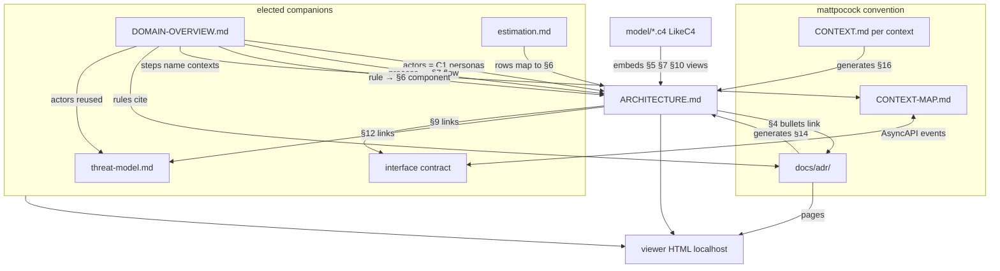

# arch-docs — design spec

**Date:** 2026-08-02 · **Status:** awaiting user approval
**Replaces:** `plugins/architecture-design` v2.0.1 (wiped in `9f98936` along with all other legacy plugins)

## 1. Purpose

A Claude Code plugin that produces professional architecture documentation for any
project type, then serves it on `localhost:<port>` for review. It combines:

- a structured interview (adaptive, capped),
- live research by agents (every claim carries provenance),
- brownfield code scanning (via `codebase-memory-mcp`),
- real interactive diagrams (LikeC4 + styled mermaid),
- a cross-consistency validator — the differentiator no existing tool has.

The legacy plugin's failures define the requirements: no research (Claude invented
facts), placeholder-driven dishonesty (`[TODO]` as a rendering state), tech coverage
limited to three stacks, no viewer, no ADRs, no estimation.

## 2. Locked decisions

| # | Decision |
|---|---|
| 1 | One skill, mode auto-detected: greenfield (design) vs brownfield (document), detected from whether the target has code |
| 2 | Provenance per fact: `observed` · `stated` · `researched` (with source) · `proposed` |
| 3 | One home per fact: diagrams own topology, tables own properties, prose owns neither |
| 4 | Elimination criterion: if an agent reads a fact faster from a config file than from the doc, the doc must not carry it |
| 5 | arc42 spine + 2 additions, own vocabulary; 16 headings, fixed |
| 6 | No `DOMAIN.md` — write into mattpocock's `CONTEXT.md` / `CONTEXT-MAP.md` formats |
| 7 | ADRs at `docs/adr/NNNN-slug.md`, mattpocock three-part gate, always include Considered Options |
| 8 | Project Structure section is brownfield-only; greenfield renders a stated absence |
| 9 | Deployment = LikeC4 deployment view + per-env table; CI/CD is a table, never a diagram |
| 10 | Fixed spine + honest N/A: non-applicable sections render `Not applicable — <reason>`; project type varies table columns and doc elections only |
| 11 | Plugin name: **arch-docs** |
| 12 | Diagrams: LikeC4 inline webcomponent for C1–C3, deployment, and runtime dynamic views; styled mermaid for ER and security DFD only |
| 13 | Viewer: `npx likec4` at generation time; all bundles vendored into one self-contained offline HTML; tiny static server, default port 4173, scan up |
| 14 | Viewer v1 ships deep-linking + dark/light; reach tracing + semantic search deferred, recorded as not-shipped-with-reason |
| 15 | Interview: adaptive, hard cap 12 questions, delivered as multi-choice cards of 4 |
| 16 | Estimation doc stays — separate, labelled non-architecture; estimates carry confidence + assumptions; `not estimated` never renders as `0` |
| 17 | `DOMAIN-OVERVIEW.md` is a fourth elected companion doc (actors, processes, rules — no events, no terms) |
| 18 | Consume LikeC4's own `skills/likec4-dsl/` skill for DSL authoring guidance (verified: exists in `likec4/likec4`, SKILL.md + references/) |

## 3. Deliverables

### 3.1 ARCHITECTURE.md — the 16-section spine

```
frontmatter: name · repo · team · updated · mode · projectType · docVersion · electedDocs

 1  Goals & Scope
 2  Constraints
 3  Project Structure            brownfield only: fs-generated tree depth ≤2 + boundary map
 4  Solution Strategy            ≤5 bullets, each links an ADR, never restates rationale
 5  Architecture Model           LikeC4 C1/C2/C3 views, no prose
 6  Core Components              table: responsibility, tech, deploy unit, key paths, context, invariants
 7  Runtime Behaviour            2–4 LikeC4 dynamic views, named flows only
 8  Data Stores                  mermaid ER + table: type, purpose, retention, PII, migration tool
 9  External Integrations        table: method, auth + credential home, failure mode, rate limit/cost,
                                 data leaving boundary, lock-in
10  Deployment & Infrastructure  LikeC4 deployment view + per-env table + CI/CD stage table
11  Crosscutting Concepts        observability, error handling, validation, config/secrets,
                                 auth mechanics, testing strategy
12  Security                     mermaid DFD + trust boundaries, authz model, link to threat model
13  Quality Requirements & SLOs
14  Decisions                    generated index of docs/adr/ (root + per-context)
15  Risks & Technical Debt
16  Glossary                     generated from all CONTEXT.md files; omitted if <5 terms, and says so
```

Contract notes:

- The ER diagram is not the domain model. ER = persistence shape; domain = concepts and
  invariants. They legitimately differ (event sourcing, CQRS). Two diagrams, two homes.
- Contested facts have one home: observability → §11 · auth mechanics → §11, auth model
  → §12 · threat list → threat-model doc · decision rationale → ADR files · debt → §15.
- Every table row carries a `src` column: `observed` / `stated` / `researched [link]` /
  `proposed`. Prose facts carry an inline tag. Diagrams carry a view-level provenance note.

### 3.2 Companion documents

Always produced: **ADRs** (ISO 42010 requires decisions + rationale + rejected
alternatives). Elected by project type and domain complexity — an un-elected doc is
recorded in frontmatter `electedDocs` with the reason, never silently absent:

| Companion | Elected when | Per-type variant |
|---|---|---|
| threat-model.md | non-trivial attack surface | STRIDE · OWASP LLM Top 10 2025 · data lineage/PII · device+transport · physical+firmware |
| interface contract | system exposes/consumes interfaces | OpenAPI · +tool schemas · data contracts +model card +datasheet · wire protocol · public API surface |
| estimation.md | user wants effort estimates | confidence + assumptions per row; unestimated rows say so |
| DOMAIN-OVERVIEW.md | domain-heavy project (fintech, health, logistics…) | — |

`DOMAIN-OVERVIEW.md` contains exactly three parts, each cross-linked:

- **Actors** — same persona names as the C1 context view; threat model reuses them
- **Processes** — actor-level steps naming CONTEXT-MAP contexts; each links its §7 flow
- **Rules** — business statements, each linking the §6 component that enforces it and
  the ADR it came from

Excluded from it (home elsewhere): terms → CONTEXT.md · domain events → CONTEXT-MAP
relationships / AsyncAPI contract · context relationships → CONTEXT-MAP.md.

### 3.3 mattpocock convention files

Written into their existing formats, never restructured:

- `CONTEXT.md` — glossary only (`**Term**:` + definition + `_Avoid_:`), one per context
- `CONTEXT-MAP.md` — contexts + relationships, only when ≥2 contexts; cross-context
  domain events live in its relationship lines
- Multi-context repos keep mattpocock's layout: `src/<context>/CONTEXT.md` and
  per-context `docs/adr/`; root `docs/adr/` is system-wide. §14 and §16 generators scan
  all of them.
- The `domain-modeling` skill is invoked during the domain interview (it is the active
  discipline: challenge terms, stress-test scenarios); arch-docs never reimplements it.

### 3.4 Doc connection graph



## 4. Plugin layout

```
plugins/arch-docs/
├── .claude-plugin/plugin.json
└── skills/arch-docs/
    ├── SKILL.md              orchestration: mode detect, phase order, hard rules
    ├── README.md             user-facing
    ├── references/           per-stage briefs agents are told to follow
    │   ├── interview.md      question bank per section, card batching, skip rules
    │   ├── research.md       agent briefs per phase, provenance rules
    │   ├── writing.md        spine contract, one-home-per-fact, src-column rules
    │   ├── project-types.md  6 profiles: columns, elections, N/A rules
    │   ├── likec4.md         thin pointer to likec4-dsl skill + our model conventions
    │   └── viewer.md         generation pipeline, mermaid theme rules
    ├── assets/
    │   ├── viewer-template.html   shell: nav, dark/light, zoom controls, deep links
    │   └── mermaid-theme.json     base theme, IBM Plex fonts, accent palette
    ├── scripts/              zero-dep .mjs, node --test, quality gates apply
    │   ├── lib/validate-*.mjs     one check per file
    │   ├── lib/embed.mjs          inline bundles into viewer HTML
    │   ├── lib/port.mjs           default 4173, scan up
    │   └── serve.mjs              tiny static file server
    └── workflows/
        └── research.js       Workflow script: phases per mode, log() on every drop
```

Repo-level: `marketplace.json` gets one entry replacing the three stale ones;
`bundle.sh` and root `README.md` are recreated (wiped with the legacy plugins).

## 5. Flow

```
detect mode (target has code → brownfield)
  → [brownfield] scan: index_repository → get_architecture clusters + fs tree
  → interview: ≤12 questions, cards of 4, skip what scan/research answered;
    domain questions invoke mattpocock domain-modeling → CONTEXT.md updates inline
  → research workflow (§6)
  → write: model/*.c4 → ARCHITECTURE.md → companions → ADRs
  → validate: all checks (§8); failure blocks render
  → render: npx likec4 gen webcomponent + vendored mermaid/ELK → one HTML → serve
```

Brownfield §6 Core Components is seeded from Leiden clusters (de-facto modules), not
folder names. `manage_adr` graph rows are read if present, never written.

## 6. Research workflow

Sequence: domain research → stack research → per-aspect design (bounded contexts must
constrain component boundaries). Implemented as a `Workflow` script
(boilerplate-scout pattern): `phase()` / `pipeline()` / JSON schema per stage, `log()`
on every dropped item so a thin result can never present as complete.

| Phase | Agents | Provenance of output |
|---|---|---|
| Domain | 2 — domain concepts/language, comparable systems | `researched` + source |
| Stack | 2–3 — verify each stated tech claim; integration facts (auth, limits, cost) | `researched`; unverifiable stays `stated` |
| Per-aspect design (greenfield only) | 4 — components, data, deployment, security | `proposed` |

Typical run: ~8 agents greenfield, ~4 brownfield (skips per-aspect; stack phase fills
only gaps the scan could not observe).

## 7. Viewer

- Generation embeds into `assets/viewer-template.html`: rendered markdown for
  ARCHITECTURE.md + companion pages + ADR pages, the LikeC4 webcomponent bundle, and
  mermaid + `@mermaid-js/layout-elk` bundles. Zero CDN — output works offline.
- Serve with `scripts/serve.mjs`; port 4173 default, scan upward if busy. Regenerate =
  rerun render step, refresh browser.
- Mermaid rules (from visual-explainer, adopted wholesale): `theme: 'base'` only; ELK
  registered explicitly (silent dagre fallback otherwise); max 10–12 nodes per diagram,
  hybrid pattern above that; never native `C4Context`; never `color:` in `classDef`;
  IBM Plex Sans + IBM Plex Mono; no violet-fuchsia accents; every diagram gets
  zoom/pan/expand controls.
- v1 ships: deep links (per section + per view), dark/light toggle, responsive nav.
  Deferred with recorded reason: reach tracing (LikeC4 covers it natively for
  architecture views), semantic search (browser find suffices for one page).

**Hard dependency:** Node + npm (for `npx likec4`). The plugin states this upfront.

## 8. Validator

One check per file in `scripts/lib/`, exit 1 blocks render:

| Check | Fails when |
|---|---|
| Table ↔ model agreement | external system, component, or store in a table but not in the LikeC4 model, or vice versa |
| Undeployed container | logical container has no `instanceOf` in any deployment node |
| Cluster drift (brownfield) | documented component matches no detected cluster, or a high-cohesion cluster has no row |
| Tree drift (brownfield) | §3 boundary map disagrees with the filesystem |
| Provenance completeness | any table row without a `src` value |
| Election record | an un-elected companion with no recorded reason |
| Link targets | any cross-doc link (rules → §6, processes → §7, §4 → ADR…) whose target is missing |

Not a placeholder counter. An un-designed section renders as un-designed, loudly.

## 9. Testing

TDD RED→GREEN→VALIDATE throughout. `scripts/lib/*` under `node --test`, each validator
check gets a failing fixture first; coverage ≥80%. Global quality gates apply: ≤200
lines/file, ≤20 lines/function, ≤3 params, ≤2 nesting levels, ≤10 functions/file.
SKILL.md and references are prose — verified by an end-to-end skill eval (one
greenfield, one brownfield dry run) after implementation.

## 10. Out of scope

- Reach tracing and semantic search in the viewer (deferred, recorded)
- Writing to `manage_adr` graph store (read-only by design)
- Runbooks, production-readiness reviews (post-launch artifacts, per SRE verdict)
- Roadmap section (folded into estimation doc)
- `understand-anything` output as a dependency (optional input only)
