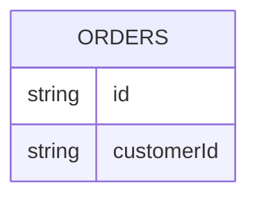

# Shop Architecture

## Goals & Scope

Minimal fixture repo for validator tests. See the [components](#core-components) section for the container list.

## Core Components

| Component | Responsibility | src |
|---|---|---|
| API | Serves REST endpoints for checkout | observed |
| Web App | Renders the storefront UI for shoppers | observed |

## External Integrations

| System | Method | src |
|---|---|---|
| Stripe | REST API for payment charges | researched [stripe docs] |

## Data Stores

| Store | Purpose | src |
|---|---|---|
| Orders | Stores customer orders and line items | observed |

## Decisions

- [sample decision](docs/adr/0001-sample.md) — records why Stripe was chosen for payments.
