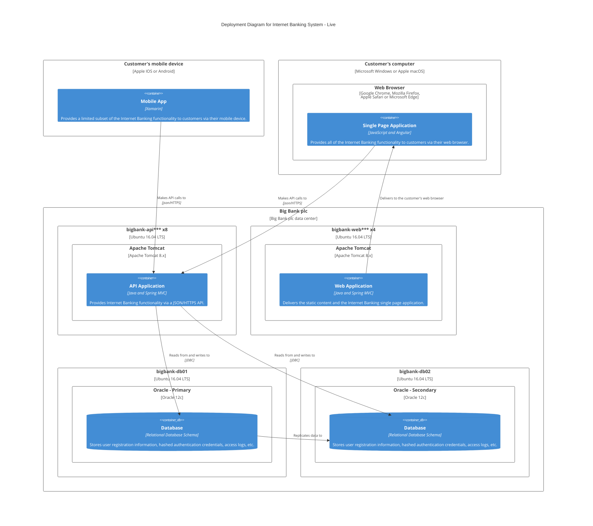

# Generate 5 Essential Architecture Diagrams in Mermaid.js

## Including C4 Level 1, 2, 3, Data Flow, and C4 Deployment

---

Goal: generate **5 essential architecture diagrams** in Mermaid.js format based on the provided system information.

---

## Instructions

Generate exactly **5 diagrams** in the following order. Each diagram should be complete, syntactically valid Mermaid code ready to render.

### Diagram 1: System Context Diagram (C4 Level 1)

**Purpose**: Show the big picture - your system in context with external users, systems, and services it connects to.

**Output Format**: Use C4Context Mermaid syntax

**Requirements**:

- Show the primary software system as the central element
- Include all external users/actors who interact with the system
- Include all external systems/services the system depends on
- Label all relationships with interaction descriptions
- Use clear, descriptive titles and descriptions

**Mermaid Syntax Template**:

```
C4Context
    title System Context - [System Name]
    Person(customer, "Customer", "End user of the system")
    System(system, "[System Name]", "Core business functionality")
    System_Ext(external, "External System", "Third-party integration")
    Rel(customer, system, "uses")
    Rel(system, external, "calls API")
```

**Key Elements to Include**:

- At least 1-2 external users
- The primary system (your product)
- 2-3 external systems/services it depends on

---

### Diagram 2: Container Diagram (C4 Level 2)

**Purpose**: Zoom into the primary system and show its main building blocks (containers) like web apps, APIs, databases, message queues, etc.

**Output Format**: Use C4Container Mermaid syntax

**Requirements**:

- Break down the system into logical containers (applications, services, databases)
- Show technology choices for each container (e.g., "Node.js API", "PostgreSQL")
- Show interactions between containers with labels
- Keep external systems visible but less detailed
- Include brief descriptions of what each container does

**Mermaid Syntax Template**:

```
C4Container
    title Container Diagram - [System Name]
    Person(user, "User", "System end user")

    System_Boundary(system, "[System Name]") {
        Container(web, "Web Application", "React", "Serves the UI")
        Container(api, "API Server", "Node.js", "Provides API services")
        Container(db, "Database", "PostgreSQL", "Stores application data")
        Container(cache, "Cache", "Redis", "Session and data caching")
    }

    System_Ext(external, "External Service", "Third-party API")

    Rel(user, web, "Uses [HTTPS]")
    Rel(web, api, "Calls [REST API]")
    Rel(api, db, "Reads/Writes [SQL]")
    Rel(api, cache, "Reads/Writes")
    Rel(api, external, "Calls [REST API]")
```

**Key Elements to Include**:

- 3-5 main containers (apps, APIs, databases, services)
- Technology stack for each container
- Container-to-container relationships

---

### Diagram 3: Component Diagram (C4 Level 3)

**Purpose**: Zoom into a specific container and show its internal components/structure (controllers, services, repositories, etc.).

**Output Format**: Use C4Component Mermaid syntax

**Requirements**:

- Focus on ONE important container (usually the API or main service)
- Show internal components/classes/modules within that container
- Show technology/framework for each component
- Show dependencies between components
- Include clear descriptions of each component's responsibility
- Keep it focused - don't show every single component, show the main 5-8

**Mermaid Syntax Template**:

```
C4Component
    title Component Diagram - [Container Name]

    Container_Boundary(container, "[Container Name]") {
        Component(ctrl, "API Controller", "Express Router", "Handles HTTP requests")
        Component(service, "Business Service", "Service Class", "Contains business logic")
        Component(repo, "Data Repository", "Data Access Layer", "Database queries")
        Component(auth, "Auth Component", "JWT/OAuth", "Handles authentication")
        Component(email, "Email Component", "Email Service", "Sends emails")
    }

    ContainerDb(db, "Database", "PostgreSQL", "Persistence")
    System_Ext(email_service, "Email Service", "SendGrid/SMTP")

    Rel(ctrl, service, "Uses")
    Rel(service, repo, "Uses")
    Rel(service, auth, "Uses")
    Rel(service, email, "Uses")
    Rel(repo, db, "Reads/Writes")
    Rel(email, email_service, "Sends via")
```

**Key Elements to Include**:

- 5-8 main internal components
- Component responsibilities clearly described
- Dependencies between components
- External dependencies (databases, services)
- Focus on one container (usually API/backend service)

---

### Diagram 4: Data Flow Diagram (DFD)

**Purpose**: Show how data moves through the system - from sources, through processes and transformations, to storage and destinations.

**Output Format**: Use flowchart syntax with data process symbols

**Requirements**:

- Identify all data sources (users, external systems)
- Show major data processing/transformation steps
- Show all data storage locations (databases, caches, files)
- Show data destinations (output systems, reports, notifications)
- Label flows with data type descriptions
- Use consistent formatting for similar element types

**Mermaid Syntax Template**:

```
flowchart LR
    subgraph sources["📥 Data Sources"]
        user["👤 User Input"]
        external["🔗 External APIs"]
    end

    subgraph processes["⚙️ Data Processing"]
        validation["Validate Data"]
        transform["Transform Data"]
        aggregate["Aggregate Data"]
    end

    subgraph storage["💾 Data Storage"]
        db["Primary DB<br/>(PostgreSQL)"]
        cache["Cache<br/>(Redis)"]
        archive["Archive<br/>(S3)"]
    end

    subgraph outputs["📤 Data Outputs"]
        api_out["API Response"]
        report["Reports"]
        notification["Notifications"]
    end

    user -->|"raw input"| validation
    external -->|"API data"| validation
    validation -->|"valid data"| transform
    transform -->|"structured data"| aggregate
    aggregate -->|"final data"| db
    aggregate -->|"hot data"| cache
    db -->|"queries"| api_out
    cache -->|"session data"| api_out
    db -->|"historical"| report
    aggregate -->|"events"| notification
    db -->|"old data"| archive
```

**Key Elements to Include**:

- Data sources (at least 2)
- Data transformation steps (at least 3)
- Data storage locations
- Data destinations
- Flow labels showing data types

---

### Diagram 5: Deployment Diagram (C4Deployment)

**Purpose**: Show how software components are deployed across physical/cloud infrastructure, environments, and how they're replicated/distributed.

**Output Format**: Use C4Deployment Mermaid syntax with Deployment_Node and Node elements

**Requirements**:

- Show deployment environments (production, staging)
- Show cloud providers or infrastructure boundaries
- Show servers/nodes/instances where containers run
- Show load balancers, databases, and other infrastructure
- Show internal connections between nodes
- Indicate scaling and high availability configurations
- Use proper C4Deployment syntax with Deployment_Node, Node, and Rel

**Mermaid Syntax Template**:

```mermaid
C4Deployment
title <Diagram Title>
    Deployment_Node(<id>, "<Name>", "<Technology/Environment>") {
      Container(<id>, "<Name>", "<Technology>", "<Description>")
    }

    Deployment_Node(<id>, "<Name>", "<Technology/Environment>") {
      Deployment_Node(<id>, "<Name>", "<Technology>") {
        Container(<id>, "<Name>", "<Technology>", "<Description>")
      }
    }

    Deployment_Node(<id>, "<Name>", "<Technology/Environment>") {
      Deployment_Node(<id>, "<Name>", "<Technology>") {
        ContainerDb(<id>, "<Name>", "<Technology>", "<Description>")
      }
    }

    Rel(<source_id>, <target_id>, "<Description>", "<Protocol>")
    Rel_U(<source_id>, <target_id>, "<Description>")
    Rel_R(<source_id>, <target_id>, "<Description>")

    UpdateRelStyle(<source_id>, <target_id>, $offsetX="<value>", $offsetY="<value>")

```

**Notes:**
- Use Deployment_Node for devices, servers, or environments.
- Use Container for applications or services.
- Use ContainerDb for databases.
- Use Rel, Rel_U, or Rel_R for relationships.
- Use UpdateRelStyle to adjust label or arrow positions.

## Example: C4Deployment for Internet Banking System



---

**Key Elements to Include**:

- Cloud provider/infrastructure boundary
- Production environment with load balancer
- Multiple instances of compute nodes for high availability
- Database with read replicas
- Caching layer
- External service connections
- Message queues for async processing

---

## Input Information Required

Before generating the diagrams, gather or confirm the following information about the system:

### Project Overview

- System name and purpose
- Primary users/actors
- Main external systems it integrates with

### Technical Components (Containers)

- List all applications/services in the system
- Technology stack for each container (language, framework)
- Database systems and their purposes
- Message queues, caches, or other data stores
- Third-party services (payment, auth, notifications, etc.)

### Internal Components (for Level 3)

- Main controller/handler types
- Key service/business logic components
- Data access/repository layers
- Utility/helper components
- Authentication/authorization components

### Data Processing

- Main data types flowing through the system
- How data enters the system (APIs, uploads, imports)
- Major processing/transformation steps
- How data is stored and how long
- How data exits the system (exports, reports, APIs)

### Infrastructure & Deployment

- Cloud provider (AWS, GCP, Azure, on-premises)
- Number of instances/replicas for high availability
- Load balancing strategy
- Database replication/backup strategy
- CDN or content delivery strategy
- Message queue setup

---

## Generation Steps

1. **Understand the context**: Read and understand the system description
2. **Generate Diagram 1**: System Context (C4 Level 1) - showing external relationships
3. **Generate Diagram 2**: Container (C4 Level 2) - showing internal components and technologies
4. **Generate Diagram 3**: Component (C4 Level 3) - showing one container's internal structure
5. **Generate Diagram 4**: Data Flow - showing how data moves through the system
6. **Generate Diagram 5**: Deployment (C4Deployment) - showing infrastructure and deployment topology

---

## Output Format

For each diagram, output:

```markdown
### Diagram [Number]: [Diagram Title]

**Description**: [One sentence about what this diagram shows]

**Focus**: [What this diagram emphasizes]

\`\`\`mermaid
[Complete Mermaid diagram code]
\`\`\`
```

---

## Quality Checklist

For each diagram, verify:

- ✅ Syntax is valid Mermaid.js code
- ✅ Diagram clearly shows the intended architectural layer
- ✅ All relationships/connections are labeled
- ✅ Component descriptions are concise and clear
- ✅ Technology choices are explicitly shown (where applicable)
- ✅ No syntax errors or unclosed elements
- ✅ Diagram is readable and not overcrowded
- ✅ Follows C4 model conventions for that level
- ✅ For C4Deployment: Uses proper Deployment_Node, Node, and Rel syntax

---

## Why All 5 Diagrams?

| Diagram                | Audience                               | Detail Level     | Purpose                                    |
| ---------------------- | -------------------------------------- | ---------------- | ------------------------------------------ |
| **Level 1: Context**   | Everyone                               | Ultra-high level | System boundary and external relationships |
| **Level 2: Container** | Tech leads, architects, devs           | High level       | Main technical components                  |
| **Level 3: Component** | Senior devs, architects                | Mid-level        | How one container is built internally      |
| **Data Flow**          | Data engineers, backend devs, security | Process level    | Data movement and transformations          |
| **Deployment**         | DevOps, SRE, ops team                  | Infrastructure   | How it runs in production                  |

---

